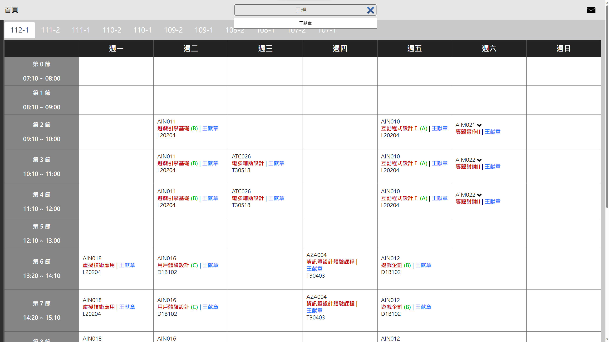
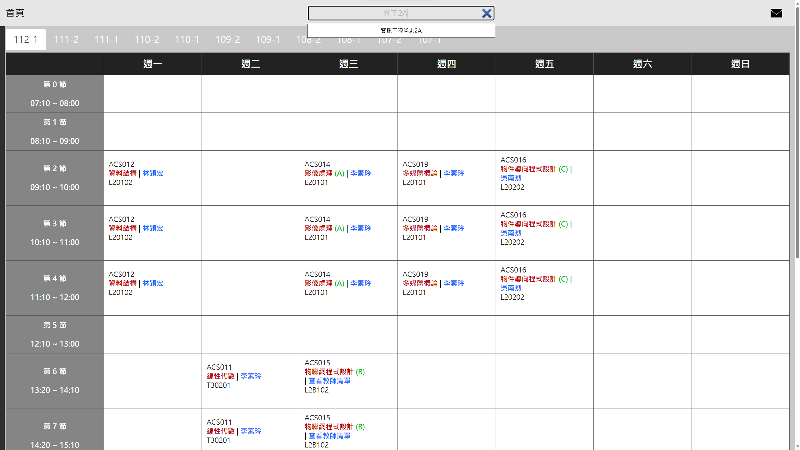
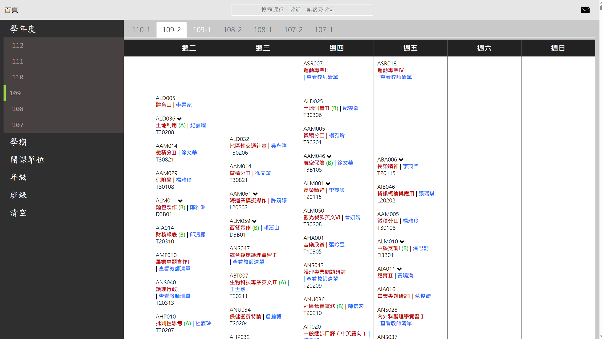
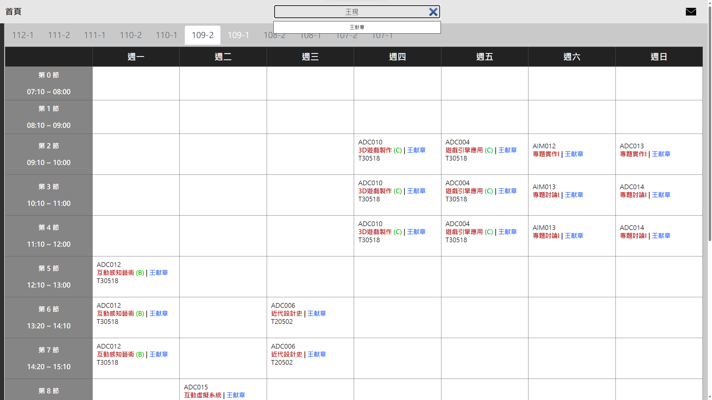

# 長榮大學課程搜尋網站

此網站為本人就讀於長榮大學資工系期間獨立開發，因即將畢業故將此網站原始碼公開讓有興趣的學弟妹能進行維護

~~絕不是我懶得加功能==~~

## 網站簡介

  - **`提供課程資訊`** - 資料來源為「[課程綱要 - 長榮大學](https://eportal.cjcu.edu.tw/syllabus)」網站所提供之課程資訊，目前以107年改制後的課程為主

  - **`排版以課表呈現`** - 在學校網站中的排列方式較無法直觀看出每堂課的開課時間，因此本網站將課程資訊以課表的方式呈現

  - **`側欄選單`** - 網站可以透過側欄篩選學年、學期、開課單位、年級及班級等

  - **`搜尋欄功能`** - 基本的搜尋提示及其他功能
    - **`同音字匹配搜尋`** - 同音字匹配如「現」與「献」可互相搜尋，讓你絕對不會再找不到「王献(ㄒㄧㄢˋ)章」教授的課程了= =
    
      <strong style="color:orange">注音辭典由黃琨義教授提供，故暫不公開注音辭典，資料庫儲存注音格式可參考SQL中的範例</strong>
    
    - **`系所名稱簡寫`** - 提供系所名稱簡寫如「資訊工程學系」簡寫為「資工」、「工程」或「資程」，亦可直接搜尋班級如「資工4A」

## 網站瀏覽

  目前因剛搬家的緣故尚未將網站對外開放，整理好若有對外會再將連結補上！暫時先放網站使用圖片

  <h3 style='text-align: center'>搜尋「王現」</h3>

  

  <h3 style='text-align: center'>搜尋「資工2A」</h3>

  

  <h3 style='text-align: center'>選擇學年度「109」</h3>

  

  <h3 style='text-align: center'>選擇學年度「109」及搜尋「王現」</h3>

  